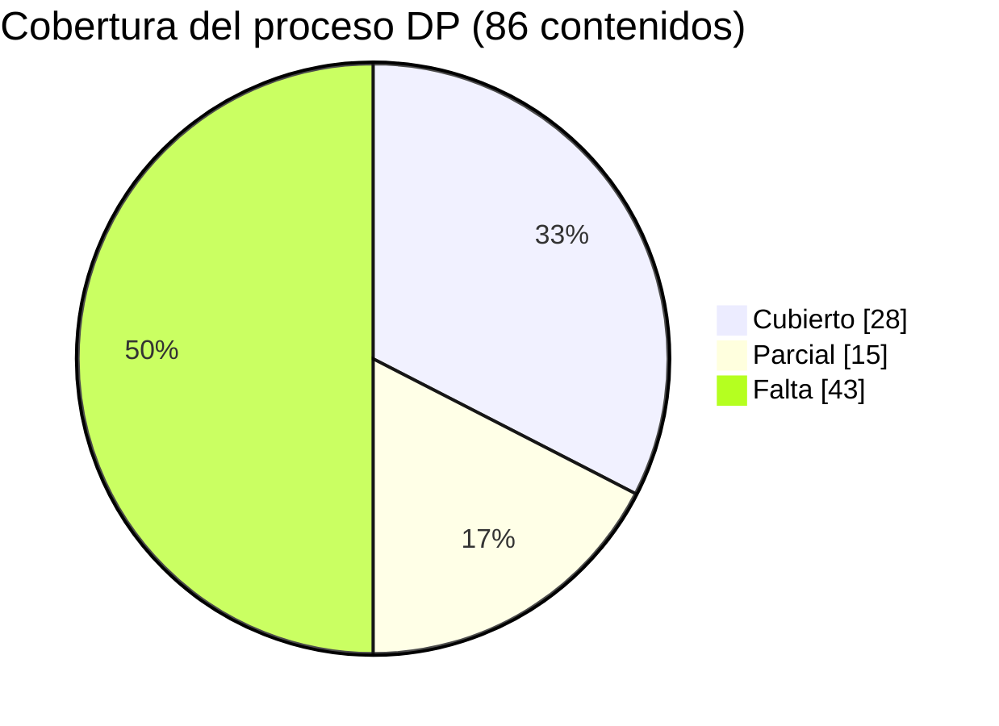

# 📊 Cobertura del proceso DP vs prompts del repositorio

**Última revisión:** 2026-07-09

Matriz de los **86 contenidos** del proceso de Data Processing (10 etapas) contra los prompts del repositorio.

**Leyenda:** ✅ Cubierto (hay prompt que lo trabaja directamente) · 🟡 Parcial (un prompt lo toca de forma indirecta o incompleta) · ❌ Falta

## Contenido

- [Resumen](#resumen)
- [Cobertura por etapa](#cobertura-por-etapa)
- [Detalle por contenido](#detalle-por-contenido)
- [Cómo actualizar este documento](#cómo-actualizar-este-documento)

## Resumen

| Estado | Cantidad | % |
|---|---|---|
| ✅ Cubierto | **28** | 33% |
| 🟡 Parcial | **15** | 17% |
| ❌ Falta | **43** | 50% |

> **Patrón general:** los prompts existentes atacan casi todo desde el lado de **QA / validación de entregables** (que es donde más valor da un LLM). Lo que falta es mayormente **operación de herramientas** (GEN, DMQuery, EasyCoding, subidas a Harmoni, migraciones, uniones, ponderación), que en gran parte es trabajo de software de escritorio y no "prompteable" directamente — aunque varios sí podrían convertirse en prompts de QA (ver [roadmap del README](../README.md#roadmap-sugerido)).

## Cobertura por etapa

| # | Etapa | ✅ | 🟡 | ❌ | Total | Carpeta | Prompts relacionados |
|---|---|---|---|---|---|---|---|
| 1 | PDT (plan de tablas) | 0 | 0 | 2 | 2 | [01-pdt](../prompts/01-pdt/) | — *(prioridad #1)* |
| 2 | Script de validación (validación integral de BD) | 9 | 3 | 2 | 14 | [02-validacion-bd](../prompts/02-validacion-bd/) | **generar-script-validacion-dms** |
| 3 | Creación y llenado de variables | 8 | 2 | 0 | 10 | [03-variables](../prompts/03-variables/) | **qa-variables-pdt-vs-scripts-dms** |
| 4 | Codificación | 1 | 0 | 4 | 5 | [04-codificacion](../prompts/04-codificacion/) | qa-libro-codigos-vs-base |
| 5 | Ponderación | 0 | 1 | 6 | 7 | [05-ponderacion](../prompts/05-ponderacion/) | qa-proyecto-harmoni (sección 12) |
| 6 | Unión de bases | 0 | 0 | 2 | 2 | [06-union-bases](../prompts/06-union-bases/) | — |
| 7 | Bases de datos | 1 | 2 | 18 | 21 | [07-bases-datos](../prompts/07-bases-datos/) | **qa-entregable-bvc-sav**, **qa-dataspec-vs-base** |
| 8 | Harmoni | 9 | 4 | 4 | 17 | [08-harmoni](../prompts/08-harmoni/) | **qa-proyecto-harmoni** |
| 9 | Proceso de tablas en Excel | 0 | 1 | 4 | 5 | [09-tablas-excel](../prompts/09-tablas-excel/) | qa-tablas-vs-pdt (QA del output) |
| 10 | SPSS básico | 0 | 2 | 1 | 3 | [10-spss](../prompts/10-spss/) | qa-entregable-bvc-sav (parcial) |
| | **Total** | **28** | **15** | **43** | **86** | | |

**Etapas fuertes:** 2 (validación de BD), 3 (variables) y 8 (Harmoni) concentran 26 de los 28 cubiertos.
**Etapas sin nada:** 1 (PDT) y 6 (unión de bases).

## Detalle por contenido

<strong>Etapa 1 — PDT</strong> (0 ✅ / 0 🟡 / 2 ❌)

| Contenido | Estado | Nota |
|---|---|---|
| Generar PDT para proyectos Set-up | ❌ | El PDT se usa como *insumo* en los QA de tablas, Harmoni y variables, pero no hay prompt que lo genere ni lo valide |
| Generar PDT para proyectos On-going | ❌ | Ídem |

<strong>Etapa 2 — Script de validación</strong> (9 ✅ / 3 🟡 / 2 ❌)

Prompt principal: [generar-script-validacion-dms.md](../prompts/02-validacion-bd/generar-script-validacion-dms.md)

| Contenido | Estado | Cubierto por |
|---|---|---|
| Revisar estructuras BD tracking (ola actual vs anterior) | ❌ | — |
| Generar frecuencias de una BD MDD/DDF | 🟡 | [qa-entregable-bvc-sav](../prompts/07-bases-datos/qa-entregable-bvc-sav.md) las *revisa*, pero no hay prompt que las genere |
| Validar muestra | ❌ | — |
| Validar códigos errados | ✅ | generar-script-validacion-dms (obligados/prohibidos) |
| Validar respuestas repetidas en múltiples | 🟡 | generar-script-validacion-dms vía exclusivas; sin regla explícita |
| Validar valores que deben ser incluidos | ✅ | generar-script-validacion-dms (`IncludeAnswers`) |
| Validar valores que deben ser excluidos | ✅ | generar-script-validacion-dms (`NotIncludeAnswers`) |
| Validar flujo del cuestionario (filtros y dependencias) | ✅ | generar-script-validacion-dms (núcleo); [auditor-scripting-ifield](../prompts/00-captura-ifield/auditor-scripting-ifield.md) a nivel captura |
| Validar códigos missing exclusivos | ✅ | generar-script-validacion-dms (`ListaExclusivas`) |
| Validar rango vs valores exactos | ✅ | generar-script-validacion-dms (`ValRangoN`, `ValNumeric`) |
| Validar variables creadas del PDT (funnel, convivencias…) | ✅ | [qa-variables-pdt-vs-scripts-dms](../prompts/03-variables/qa-variables-pdt-vs-scripts-dms.md) |
| Validar que no haya datos vacíos {} | ✅ | generar-script-validacion-dms (`ValDatos` con condición True) |
| Validar migración a SAV sin pérdida de casos | 🟡 | qa-entregable-bvc-sav valida integridad del SAV entregado; no compara conteo vs MDD origen |
| Otras validaciones varias | ✅ | generar-script-validacion-dms (sumas, mayor/menor, mensajes) |

<strong>Etapa 3 — Creación y llenado de variables</strong> (8 ✅ / 2 🟡 / 0 ❌)

Prompt principal: [qa-variables-pdt-vs-scripts-dms.md](../prompts/03-variables/qa-variables-pdt-vs-scripts-dms.md)

| Contenido | Estado | Cubierto por |
|---|---|---|
| Variables estándar (Enc, Total, WTVAR, ID_Unico…) | ✅ | qa-variables-pdt-vs-scripts-dms |
| Variables para pase de datos | 🟡 | Solo si figuran en el PDT |
| Variables del PDT | ✅ | qa-variables-pdt-vs-scripts-dms (misión central) |
| Variables Reco y No Reco | ✅ | qa-variables-pdt-vs-scripts-dms vía PDT |
| Variables Funnel | ✅ | qa-variables-pdt-vs-scripts-dms vía PDT |
| Variables para cuadro resumen | ✅ | qa-variables-pdt-vs-scripts-dms vía PDT |
| Variables para codificación (PXX_CODED) | ✅ | qa-variables-pdt-vs-scripts-dms + [qa-libro-codigos-vs-base](../prompts/04-codificacion/qa-libro-codigos-vs-base.md) |
| Variables de convivencia | ✅ | qa-variables-pdt-vs-scripts-dms vía PDT |
| Variables de preferencia para INNO | 🟡 | Nada específico de INNO |
| Variables NPS (para HMN) | ✅ | [qa-proyecto-harmoni](../prompts/08-harmoni/qa-proyecto-harmoni.md) (check de NPS como measure) |

*Nota: los prompts auditan la creación, no la generan — pero el contenido queda cubierto desde QA.*

<strong>Etapa 4 — Codificación</strong> (1 ✅ / 0 🟡 / 4 ❌)

| Contenido | Estado | Nota |
|---|---|---|
| Estándar Perú (old) | ❌ | |
| EasyCoding | ❌ | Operación de herramienta |
| GeniusLab | ❌ | Operación de herramienta |
| Pegar variables (información enviada por la SL) | ✅ | [qa-libro-codigos-vs-base](../prompts/04-codificacion/qa-libro-codigos-vs-base.md) audita el resultado del pegado |
| Generar variables Proven | ❌ | |

<strong>Etapa 5 — Ponderación</strong> (0 ✅ / 1 🟡 / 6 ❌)

| Contenido | Estado | Nota |
|---|---|---|
| RIM | ❌ | |
| Target | ❌ | |
| Pesos por encuesta (pegar ponderación de SL) | ❌ | |
| Revisar ponderación (suma total y variables usadas) | 🟡 | [qa-proyecto-harmoni](../prompts/08-harmoni/qa-proyecto-harmoni.md) sección 12 + WTVAR; [qa-variables-pdt-vs-scripts-dms](../prompts/03-variables/qa-variables-pdt-vs-scripts-dms.md) revisa hoja Ponderación del PDT |
| Generar tabla de factores de ponderación | ❌ | |
| (Colombia) Base SPSS para datos muestrales | ❌ | |
| Enviar eficiencia de ponderación a la SL | ❌ | |

<strong>Etapa 6 — Unión de bases</strong> (0 ✅ / 0 🟡 / 2 ❌)

| Contenido | Estado |
|---|---|
| Horizontal (visitas) | ❌ |
| Vertical (Setup u OnGoing con/sin historia en HMN) | ❌ |

<strong>Etapa 7 — Bases de datos</strong> (1 ✅ / 2 🟡 / 18 ❌)

| Contenido | Estado | Nota |
|---|---|---|
| DMQuery | ❌ | |
| BD BVC con Alert Form | 🟡 | [qa-entregable-bvc-sav](../prompts/07-bases-datos/qa-entregable-bvc-sav.md) revisa el reporte de inconsistencias del entregable, no la generación |
| BD BVC con DataSpecs | ✅ | [qa-dataspec-vs-base](../prompts/07-bases-datos/qa-dataspec-vs-base.md) (DataSpec vs base vs plantilla) |
| BD Binarizada | ❌ | |
| Bases especiales (Datamap de SL) | ❌ | |
| BD Transpuesta para INNO | ❌ | |
| BD Transpuesta para publicidad | ❌ | |
| BD Transpuesta para otros | ❌ | |
| RawData INNO (plantilla) | ❌ | |
| RawData INNO (formato manual) | ❌ | |
| Agregar idiomas a la BD | ❌ | |
| Easy Translation | ❌ | |
| Migrar MDD/DDF a SAV | 🟡 | qa-entregable-bvc-sav valida el SAV resultante |
| Migrar MDD/DDF a XLS | ❌ | |
| Migrar SAV a MDD/DDF (DataLab) | ❌ | |
| Migrar XLS a MDD/DDF | ❌ | |
| Generar verbatines en XLS | ❌ | |
| Eliminar variables de un DDF | ❌ | |
| Generar CASAM | ❌ | |
| Convertir bases de Ipsos Digital | ❌ | |
| Upload Global QuestionMapping | ❌ | |

<strong>Etapa 8 — Harmoni</strong> (9 ✅ / 4 🟡 / 4 ❌)

Prompt principal: [qa-proyecto-harmoni.md](../prompts/08-harmoni/qa-proyecto-harmoni.md)

| Contenido | Estado | Nota |
|---|---|---|
| Solicitar creación de site | ❌ | Procedimiento |
| Subida de proyecto Setup | 🟡 | qa-proyecto-harmoni audita el proyecto ya subido |
| Subida de proyecto OnGoing | 🟡 | Ídem |
| Subida de proyecto Multilevel | 🟡 | Ídem (check específico multi-level en grids) |
| Crear árbol Harmoni | ✅ | qa-proyecto-harmoni (secciones y estructura) |
| Ubicar variables según orden del PDT | ✅ | qa-proyecto-harmoni (check de orden) |
| Crear Grids | ✅ | qa-proyecto-harmoni (check 8) |
| Crear Measures | ✅ | qa-proyecto-harmoni (check 11) |
| Crear NPS | ✅ | qa-proyecto-harmoni (fórmula NPS como measure) |
| Agregar Values | ✅ | qa-proyecto-harmoni (respuestas/values) |
| Indicadores (Top, Bottom, IM…) | ✅ | qa-proyecto-harmoni (estadísticos) |
| Construcción/ajuste de variables | ✅ | qa-proyecto-harmoni (preguntas + neteos) |
| Generar tablas en Harmoni (stories) | ❌ | No hay check de stories |
| Configurar filtros globales | ✅ | qa-proyecto-harmoni (bases y filtros) |
| Configurar multilanguages | 🟡 | Solo revisa idioma uniforme / INNO en inglés |
| Solicitar aprobación para publicar | ❌ | Procedimiento |
| Publicación (Setup y On-going) | ❌ | Procedimiento |

<strong>Etapa 9 — Proceso de tablas en Excel</strong> (0 ✅ / 1 🟡 / 4 ❌)

| Contenido | Estado | Nota |
|---|---|---|
| Uso del GEN | ❌ | Operación de herramienta |
| Configurar MRS para tabular | ❌ | |
| Formatear tablas en Artifact | 🟡 | [qa-tablas-vs-pdt](../prompts/09-tablas-excel/qa-tablas-vs-pdt.md) valida formato/estructura del output final |
| Plantillas según país y SL | ❌ | |
| Tablas especiales XLS (Monitor Colombia, IFE, ABT) | ❌ | |

*Nota: el QA del entregable de esta etapa SÍ está cubierto (qa-tablas-vs-pdt revisa las tablas finales vs PDT/cuestionario/LC banner por banner); lo que falta es la parte de generación con GEN/MRS.*

<strong>Etapa 10 — SPSS básico</strong> (0 ✅ / 2 🟡 / 1 ❌)

| Contenido | Estado | Nota |
|---|---|---|
| Tablas de resultados básicos para revisar BD | 🟡 | [qa-entregable-bvc-sav](../prompts/07-bases-datos/qa-entregable-bvc-sav.md) revisa frecuencias del SAV |
| Renombrar variables | ❌ | |
| Etiquetar variables | 🟡 | qa-entregable-bvc-sav valida etiquetas del entregable, no el etiquetado |

## Cómo actualizar este documento

Cuando agregues un prompt nuevo:

1. Cambia el estado de los contenidos que cubre (❌ → 🟡 o ✅) en la tabla de la etapa.
2. Ajusta los contadores de la etapa y del **Resumen** (incluido el gráfico mermaid).
3. Agrega el prompt a la tabla del [README](../README.md#prompts-disponibles).
